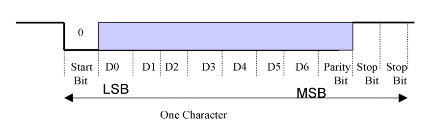
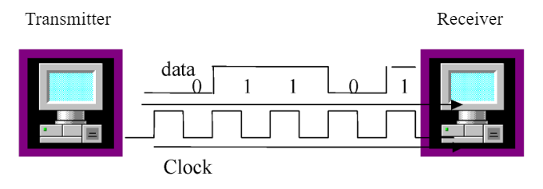

## Chapter 14: Transmission Types

_Originally created 29 March 2021, by Maxwell Hauser — Updated 8 October 2025._

_Builds upon material from Chapter 13: Clock Signals._

---

### Overview

When data is transferred from one computer to another using digital signals, the receiving computer must distinguish the size of each signal to determine when a signal ends and when the next one begins. Synchronization methods between source and destination devices are generally grouped into two categories: **asynchronous** and **synchronous**.

---

## Asynchronous Transmission   

Asynchronous transmission occurs character by character and is used for serial communication, such as by a modem or serial printer. In asynchronous transmission, each data character has:

- A **start bit** that identifies the start of the character
- **Data bits** (typically 7 or 8 bits)
- An optional **parity bit** for error detection
- **Stop bit(s)** (one or two bits) that identify the end of the character

After the parity bit is sent, the signal must return to high for at least one bit time to identify the end of the character. The start bit serves as an indicator to the receiving device that a data character is coming and allows the receiving side to synchronize its clock. Since the receiver and transmitter clocks are not synchronized continuously, the transmitter uses the start bit to reset the receiver clock so that it matches the transmitter clock.

> 

---

## Synchronous Transmission

Some applications require transferring large blocks of data, such as a file from disk or transferring information from a computer to a printer. Synchronous transmission is an efficient method of transferring large blocks of data by using time intervals for synchronization.

One method of synchronizing transmitter and receiver is through the use of an external connection that carries a clock pulse. The clock pulse represents the data rate of the signal and is used to determine the speed of data transmission. The receiver reads each bit according to the clock timing.

> 

An extra connection is required to carry the clock pulse for synchronous transmission. In networking, one medium is used for transmission of both information and the clock pulse. The two signals are encoded in a way that the synchronization signal is embedded into the data. This can be done with **Manchester encoding** or **Differential Manchester encoding**.

---

## Summary

1. **Asynchronous Transmission:**
   - Character-by-character transmission
   - Uses start and stop bits for synchronization
   - Suitable for low-speed serial communication
   - No continuous clock synchronization required

2. **Synchronous Transmission:**
   - Block-based data transmission
   - Uses clock signals for synchronization
   - More efficient for large data transfers
   - Clock can be external or embedded in the data

